# infinigen学习&调试记录
本项目是学习`https://github.com/princeton-vl/infinigen.git`过程的一些记录

isaacsim官方: https://docs.isaacsim.omniverse.nvidia.com/5.1.0/replicator_tutorials/tutorial_replicator_infinigen_sdg.html

## 安装
```
cd ~
mkdir d-infinigen && cd d-infinigen
git clone https://github.com/princeton-vl/infinigen.git
cd ~/d-infinigen/infinigen
git clone git@github.com:FelixFu520/infinigendocs.git

# 安装infinigen
sudo apt-get install wget cmake g++ libgles2-mesa-dev libglew-dev libglfw3-dev libglm-dev zlib1g-dev
conda create --name infinigen python=3.11
conda activate infinigen

# Installing Infinigen as a Python Module
pip install -e ".[dev,terrain,vis,sim]"
pre-commit install

# Installing Infinigen as a Blender Python script
INFINIGEN_INSTALL_CUSTOMGT=True bash scripts/install/interactive_blender.sh

```

## 使用
### Baseline
```
conda activate infinigen
mkdir -p ~/d-infinigen/outputs
cd ~/d-infinigen/infinigen
ln -s ../outputs outputs

# Generate a blender file
python -m infinigen_examples.generate_indoors \
    --seed 0 \
    --task coarse \
    --output_folder ../outputs/baseline/coarse \
    -g fast_solve.gin singleroom.gin \
    -p compose_indoors.terrain_enabled=False restrict_solving.restrict_parent_rooms=\[\"DiningRoom\"\]

# 使用blender可视化
python -m infinigen.launch_blender ../outputs/baseline/coarse/scene.blend

# 导出usd文件
# my_export1效果一般
python -m infinigen.tools.export \
    --input_folder ../outputs/baseline/coarse \
    --output_folder ../outputs/baseline/my_export \
    -f usdc \
    -r 1024
# my_export2效果和my_export1区别不大
python -m infinigen.tools.export \
    --input_folder ../outputs/baseline/coarse \
    --output_folder ../outputs/baseline/my_export2 \
    -f usdc \
    -r 1024 \
    --omniverse
# my_export3效果变好
python -m infinigen.tools.export \
    --input_folder ../outputs/baseline/coarse \
    --output_folder ../outputs/baseline/my_export3 \
    -f usdc \
    -r 4096 \
    --omniverse

# 使用isaacsim查看
cd ~/d-isaacsim
./app/isaac-sim.sh \
--/persistent/isaac/asset_root/default=/home/fufa/isaac_sim/5.1_asset/Assets/Isaac/5.1

```
### 找原因
infinigen生成的资产导出成usdc后, 不逼真, 让Deep Research做了下报告, 报告结果如下

- [infinige2isaac_research-1.docx](docs/infinige2isaac_research-1.docx)
- [infinige2isaac_research-2.docx](docs/infinige2isaac_research-2.docx)

### 解决问题
解决完object的几何形状后，需要在物体表面贴上 决定光学捕捉效果的视觉材质（Visual Materials）、决定力学交互与接触响应的物理材质（Physics Materials），以及决定电磁波形（如激光雷达、毫米波雷达）反射特征的非视觉传感器材质（Non-visual Sensor Materials）。
#### 先了解纹理、材质、PBR
- PBR 有那些参数？ 参数类型
- 如何把pbr和object关联起来？ 如何程序化修改

PBR（Physically Based Rendering）是一套**模拟真实世界光照与材质交互物理规律的渲染体系**，核心目标是实现物理正确性与跨光照环境一致性，让虚拟材质在不同光源下表现出与现实世界一致的反光、漫射、折射等行为，大幅降低美术试错成本并提升渲染真实感


##### **PBR 核心物理基础**
```
1. 微表面理论（Microfacet Theory）
现实中没有绝对光滑的表面，所有物体表面在微观尺度下都是由无数微小平面（微表面）组成的。
光滑表面：微表面法线方向集中，反射光线方向一致，形成清晰高光
粗糙表面：微表面法线方向随机分布，反射光线向各个方向散射，高光模糊且范围大
核心影响：微表面几何决定了光线反射的方向分布和强度衰减

2. 能量守恒（Energy Conservation）
PBR 最基本的物理约束：出射光线总能量 ≤ 入射光线总能量（自发光物体除外）。
数学表达：漫反射光 (kD) + 镜面反射光 (kS) ≤ 入射光能量
关键推论：粗糙表面高光范围大但强度低；光滑表面高光集中且强度高，符合能量守恒
金属与非金属差异：金属反射率 60%-90%，几乎无漫反射；非金属反射率 0%-20%，漫反射是颜色主要来源
3. 菲涅尔效应（Fresnel Effect）
反射率随观察角度变化的物理现象，由法国物理学家 Augustin-Jean Fresnel 发现。
核心规律：正视表面时反射率最低；视角越倾斜（掠射角），反射率越高，趋近于 100%
常见示例：水面正视时能看到水下物体；侧视时几乎像镜子，完全反射天空
材质差异：金属与非金属的菲涅尔基础值 (F0) 不同，决定了不同材质的反射特性
```

##### **PBR核心参数**
```
现代 PBR 工作流采用金属度 / 粗糙度 (Metallic-Roughness) 工作流（主流）或镜面反射 / 粗糙度 (Specular-Glossiness) 工作流，以下以主流的 Metallic-Roughness 为例：
```
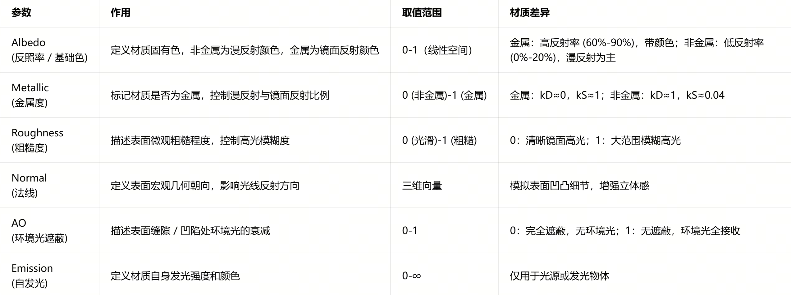

##### **PBR 工作流程与实现要点**
```
1. 核心渲染流程
光照计算：计算光源方向、强度与表面的交互
BRDF 评估：根据微表面理论和菲涅尔效应计算漫反射与镜面反射分量
能量整合：确保总能量不超过入射能量，应用能量守恒约束
环境光贡献：加入 IBL（图像基光照）模拟间接光照，提升真实感
色调映射：将高动态范围 (HDR) 渲染结果转换为显示器可显示的低动态范围 (LDR) 图像
2. 关键技术要点
线性工作流：PBR 必须在线性颜色空间中计算，避免伽马校正导致的物理错误
HDR 环境贴图：提供准确的环境光照信息，用于 IBL 计算，是 PBR 真实感的重要来源
物理正确的光源：光源强度需符合现实物理单位（如勒克斯、坎德拉），避免主观调整
材质参数标准化：金属度和粗糙度参数需遵循物理规律，避免超出合理范围（如非金属 F0≈0.04）
```


##### **Isaacsim中材质区别**

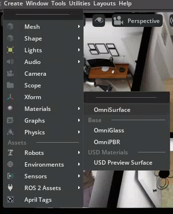
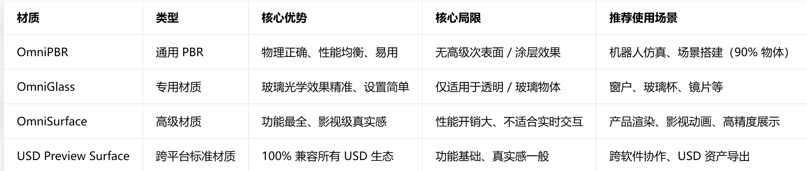


##### BSDF 通俗解释
BSDF（Bidirectional Scattering Distribution Function，双向散射分布函数）是描述光线与物体表面交互后，如何向各个方向散射的数学模型，是 PBR 渲染的核心底层理论之一

BSDF 是 PBR 的「灵魂」：它用数学语言定义了「光和物质怎么互动」，让虚拟物体在任何光照下都能表现出和现实一致的反光、透光、散射行为，是实现「照片级真实感」的基础。

```
1. 先搞懂：为什么叫「双向散射」？
双向：指 ** 入射方向（ωᵢ）和出射方向（ωₒ）** 是对等的，光路可逆 —— 光从 A 方向打过来、向 B 方向散射的强度，和光从 B 方向打过来、向 A 方向散射的强度完全一致。
散射：不只是「反射」，还包括透射（光穿过物体）、次表面散射（光钻进物体内部再跑出来）等所有光线偏折行为。
简单说：BSDF 就是「光线碰到表面后，往哪走、走多少」的标准答案

2. BSDF 的家族构成
BSDF 是一个「总类」，根据光线是否穿透物体，拆成几个核心子类：
```
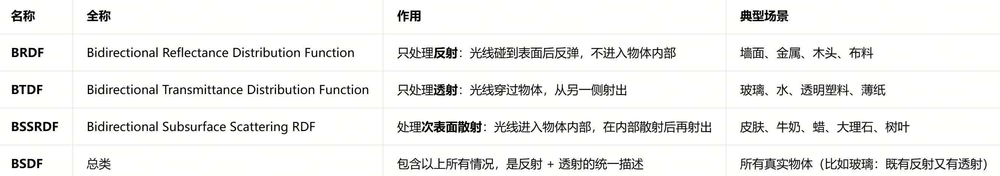

##### Mesh & GeomSubset / Material & Shader
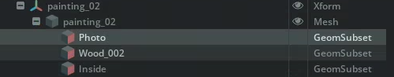
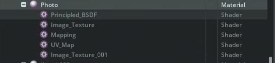
```
在 USD/Omniverse（包括 Isaac Sim）的体系里，GeomSubset（几何子集） 是实现「一个 Mesh 物体，多区域不同材质 / 属性」的核心方案
```

```
在 Isaac Sim（基于 USD /Odinverse 架构）中，材质（Material）本质不是一个单一 “球”，而是一个由多个 Shader 节点组成的 “计算网络”。图中 Photo 材质下的 Principled BSDF、Image Texture 等，就是这个网络里的功能节点—— 每个 Shader 负责一个具体任务（算颜色、读纹理、调 UV 等），通过连接形成完整的渲染逻辑。

下面结合你的截图，拆解每个 Shader 的作用、层级关系和底层逻辑：

一、核心结构：材质 = Shader 网络容器
先理清层级（从外到内、从总到分）：

Photo (Material)  ← 材质根节点（容器，管理整个渲染逻辑）
├── Principled BSDF (Shader)  ← 核心表面Shader（渲染的“灵魂”）
├── Image Texture (Shader)  ← 纹理采样Shader（读取图片数据）
├── Mapping (Shader)  ← UV映射Shader（调整纹理坐标计算方式）
└── UV Map (Shader)  ← UV坐标Shader（提供原始纹理映射坐标）

关键逻辑：最终渲染结果 = 所有 Shader 节点计算后的数据流转 → 从 UV Map 提供坐标 → Mapping 调整坐标 → Image Texture 读取纹理 → 传入 Principled BSDF 计算最终表面颜色 / 高光 → 输出到材质的 Surface 端口。


二、逐个 Shader 详解（对应你的截图）
1. ✨ Principled BSDF（核心表面 Shader）
定位：材质网络的核心计算中心，是 PBR 渲染的本质实现（对应之前讲的 OmniPBR/OmniSurface 底层逻辑）。
作用：基于物理规则，整合所有输入（纹理、颜色、粗糙度等），计算光线与物体表面的交互结果（反射、漫反射、高光等）。
你的场景作用：它是 Photo 材质的 “核心大脑”，接收 Image Texture 传来的画布纹理，计算出画布的 PBR 渲染结果，最终输出给材质。
关键输入：Base Color（基础色）、Roughness（粗糙度）、Metallic（金属度）、Normal（法线）等 —— 这些输入都可以由其他 Shader（如 Image Texture）传入。

2. 🖼️ Image Texture（纹理采样 Shader）
定位：读取外部纹理图片的节点，是连接 “物理贴图” 和 “渲染逻辑” 的桥梁。
作用：加载你指定的图片（比如画布的照片纹理），解析图片的 RGB/Alpha 数据，按 UV 坐标提取对应位置的像素值，传递给后续节点。
你的场景作用：负责读取 “画布” 的具体纹理图片（比如画的图案），把图片数据转换成渲染可用的数值，传给 Principled BSDF 作为基础色。
关键属性：File（指定图片路径）、UV Set（关联哪个 UV 集）、Scale/Offset（纹理缩放 / 偏移）。

3. 🧭 Mapping（UV 映射 Shader）
定位：UV 坐标的 “调整器”，负责对原始 UV 坐标进行变换。
作用：对 UV 坐标做平移、缩放、旋转，实现纹理平铺、错位、反转等效果，确保纹理在模型上的贴合度符合预期。
你的场景作用：如果画布的纹理需要调整平铺次数（比如让画的图案更密 / 更疏），就通过这个节点修改 UV 坐标，再传给 Image Texture。
关键输入：原始 UV 坐标（来自 UV Map）、Scale（缩放）、Offset（偏移）、Rotation（旋转）。

4. 📍 UV Map（UV 坐标 Shader）
定位：原始 UV 坐标的 “提供者”，是纹理映射的基础。
作用：从模型的 Mesh 中读取原始 UV 数据（模型建模时定义的顶点纹理坐标），传递给 Mapping 节点做后续调整。
你的场景作用：为整个材质网络提供 “基准坐标”—— 比如画布模型的 UV 是如何展开的（四角对应图片四角），由这个节点提供。
关键属性：UV Set Name（对应模型的哪个 UV 集，Isaac Sim 中模型通常只有 1 个 UV 集）


三、关键逻辑总结（必懂）
数据流转不可逆：UV 坐标从 UV Map 流出 → 经 Mapping 调整 → 传入 Image Texture → 纹理像素值传入 Principled BSDF → 最终计算结果输出到材质。这个链条断了任何一环，材质就会显示错误（比如全黑、纹理缺失）。
Shader 的 “分工明确”：
负责 “算物理” 的：Principled BSDF（核心）
负责 “读图片” 的：Image Texture
负责 “调坐标” 的：Mapping + UV Map
每个 Shader 只做一件事，组合起来完成复杂渲染。
与 PBR/BSDF 的关联：你截图里的 Principled BSDF，本质就是 PBR 渲染中 BSDF（双向散射分布函数）的 USD 实现—— 它用 Shader 节点的形式，把 BSDF 的数学计算（漫反射、高光、菲涅尔）落地成可操作的渲染节点。

四、Isaac Sim 实操对应
你在 Isaac Sim 中看到的这个结构，是在 Material Graph（材质编辑器） 里的标准布局：
双击 Photo 材质，打开 Material Graph，就能看到上述节点连接；
双击 Image Texture 节点，可在右侧 Details 面板更换图片（比如换画布上的画）；
调整 Mapping 节点的 Scale，可控制纹理在画布上的平铺大小；
断开 Image Texture 与 Principled BSDF 的连接，画布就会变成 Principled BSDF 预设的基础色（全白 / 全灰）。


一句话终极总结
在 Isaac Sim 中，材质是一个 “计算流水线”，每个 Shader 都是流水线上的 “功能工位”。Principled BSDF 是核心工位（算最终效果），Image Texture/Mapping/UV Map 是辅助工位（喂数据、调数据），它们协同工作，才能让 Photo 材质正确显示 “画布” 的纹理效果。


```

```
在 Isaac Sim（基于 PBR 材质体系）中，一个材质里出现两个 Image Texture 节点，是因为它们分别负责不同的物理渲染通道—— 一张贴图只做一件事，这是 PBR 材质「物理正确性」的核心设计。
结合你的场景（Photo 材质），这两个节点的分工非常明确

1. 第一个 Image Texture：Color 图（Base Color / Albedo）
作用：决定物体的基础颜色、图案、固有色，也就是我们肉眼看到的「物体本身的样子」。
对应你的场景：这张图是画布上的「画本身」，比如风景、人物、抽象图案，它的 RGB 数据直接决定了画布的颜色和内容。
节点连接：输出 RGB → 连接到 Principled BSDF 的 Base Color / Diffuse Color 输入端口。
特点：
包含完整的色彩信息（红、绿、蓝）。
不参与光影凹凸计算，只负责「上色」。

2. 第二个 Image Texture：Normal 图（法线贴图）
作用：模拟物体表面的微观凹凸细节，让平面模型看起来有立体感，而不需要真的修改模型几何。
对应你的场景：这张图是画布的「纹理质感」，比如画布的纤维纹理、画的笔触起伏、画框的木纹凹凸，它会欺骗渲染器，让光线在这些「虚拟凹凸」上产生明暗变化，提升真实感。
节点连接：输出 RGB → 通常先经过一个 Normal Map 节点（将纹理颜色转换为法线向量）→ 再连接到 Principled BSDF 的 Normal 输入端口。
特点：
颜色整体偏蓝紫色（因为法线向量的 Z 分量占主导，对应蓝色通道）。
完全不影响物体颜色，只影响光影和立体感。

3. 为什么必须用两个独立节点？
（1）PBR 材质的「通道分离」原则
PBR 渲染要求每个物理属性对应独立的贴图通道：
颜色 → Base Color 通道
凹凸 → Normal 通道
粗糙 → Roughness 通道
金属 → Metallic 通道
环境光遮蔽 → AO 通道
每个通道都需要一张单独的贴图，所以每个贴图都需要一个 Image Texture 节点来读取，再连接到 Principled BSDF 的对应输入。
（2）数据用途完全不同
Color 图：给「人眼」看的色彩数据，决定物体长什么颜色。
Normal 图：给「渲染器」看的向量数据，决定光线如何在表面反射，模拟凹凸光影。
如果把它们混在一张图里，数据会互相干扰，导致渲染结果既颜色错乱又光影失真。
（3）灵活性更高
你可以单独调整每个贴图的 UV 映射：
比如让 Color 图（画）平铺 1 次（完整显示一张画）。
让 Normal 图（画布纹理）平铺 4 次（让纹理更细密）。
也可以单独关闭某个通道（比如临时隐藏 Normal 图，看纯颜色效果），方便调试和优化。

4. 结合你的 Photo 材质的直观理解
Color 图：是「画的内容」—— 比如梵高的《星空》图案。
Normal 图：是「画的质感」—— 比如画布的粗糙纤维、颜料的笔触凸起，让画看起来不是贴在光滑塑料上，而是真的有纹理的油画布。
两者结合，才能让虚拟的「画」看起来既内容真实，又质感真实 ✨。
```

##### Isaac Sim 中 PBR 材质生成完整流程总结
```
下面是从0 到 1创建并应用材质的全流程，结合你之前的 Photo 材质（含 Color/Normal 贴图）和 GeomSubset 场景，一步步拆解：
一、前期准备：资源与模型
1. 纹理资源准备
准备好各类 PBR 贴图：
    Base Color/Albedo：物体固有色 / 图案（如你的画布照片）
    Normal Map：模拟表面凹凸（如画布纤维纹理）
    （可选）Roughness/Metallic/AO：控制粗糙 / 金属 / 环境光遮蔽
贴图格式推荐：PNG/JPEG，尺寸为 2 的幂（如 1024×1024），路径无中文 / 空格。

2. 模型准备
场景中已有目标模型（如 painting_02 Mesh），且已划分好 GeomSubset（如 Photo 画布区域）。
模型需包含UV 展开信息（否则纹理无法正确映射）。

二、创建材质容器
1. 在 Isaac Sim 顶部菜单：Create > Materials > OmniPBR（或 USD Preview Surface），生成一个空材质（如命名为 Photo）。

2. 这个材质是容器节点，后续所有 Shader 节点都将挂载在它下面，形成完整渲染网络。

三、构建 Shader 节点网络（核心步骤）
1. 添加核心计算节点：Principled BSDF
这是材质的「大脑」，负责 PBR 物理计算（对应 BSDF 理论）。
它提供了 Base Color、Normal、Roughness、Metallic 等输入端口，用于接收各类纹理数据。

2. 添加纹理采样节点：Image Texture（多个）
Color 贴图节点：
    加载 Base Color 图片（画布图案），输出 RGB → 连接到 Principled BSDF 的 Base Color 端口。

Normal 贴图节点：
    加载 Normal Map 图片（画布凹凸纹理），先连接到 Normal Map 节点（将颜色转法线向量），再输出到 Principled BSDF 的 Normal 端口。

（可选）若有 Roughness/Metallic 贴图，再添加对应 Image Texture 节点，连接到对应端口。

3. 添加 UV 控制节点
UV Map：从模型中读取原始 UV 坐标，作为纹理映射的基准。
Mapping：对 UV 坐标进行缩放 / 平移 / 旋转，调整纹理在模型上的平铺大小、位置（如让画布纹理更细密）。
连接关系：UV Map → Mapping → Image Texture（所有贴图共享同一套 UV 控制，或单独控制）。


四、节点连接与逻辑验证
确保数据流向正确：
plaintext
UV Map → Mapping → Image Texture (Color) → Principled BSDF (Base Color)
                  → Image Texture (Normal) → Normal Map → Principled BSDF (Normal)
                  → （其他贴图）→ Principled BSDF (对应端口)
验证：连接完成后，Principled BSDF 的 Surface 输出会自动绑定到材质的 Surface 端口，材质预览球会显示最终效果。

五、参数调整与优化
纹理映射调整：修改 Mapping 节点的 Scale（如 (2,2) 让纹理重复 2 次）、Offset 微调位置。
PBR 参数微调：
非金属材质（如画布）：Metallic 设为 0，Roughness 设为 0.5~0.8（模拟画布粗糙感）。
金属材质（如画框）：Metallic 设为 1，Roughness 按需调整。
Normal 强度：在 Normal Map 节点调整 Scale，控制凹凸感的强弱（避免过度失真）。

六、应用材质到目标物体（或 GeomSubset）
选中目标：在 Stage 面板选中要赋材质的物体（如 painting_02 Mesh）或具体 GeomSubset（如 Photo 画布区域）。
绑定材质：
方式 1（UI）：右键材质 → Apply to Selected。
方式 2（Python）：通过 UsdShade.MaterialBindingAPI 绑定到目标 Prim/GeomSubset。
验证效果：视口中会立即显示材质效果，若纹理错位 / 缺失，回到 UV 节点排查。


七、调试与迭代
问题排查：
纹理全黑：检查 Image Texture 路径是否正确、节点连接是否中断。
纹理拉伸：调整 Mapping 节点的 Scale，或检查模型 UV 展开是否合理。
质感假：补充 Roughness/Metallic 贴图，调整 PBR 参数符合物理规律。
迭代优化：根据场景光照，微调材质参数，确保跨光照环境表现一致。


核心总结 ✨
材质 = 容器 + Shader 网络：Material 是外壳，Principled BSDF + 各类 Image Texture/UV 节点是核心计算逻辑。
通道分离原则：不同物理属性（颜色 / 凹凸 / 粗糙）用独立 Image Texture 节点，避免数据干扰。
灵活应用：材质可直接绑定到 Mesh，也可绑定到 GeomSubset，实现「一个模型多区域不同材质」

```
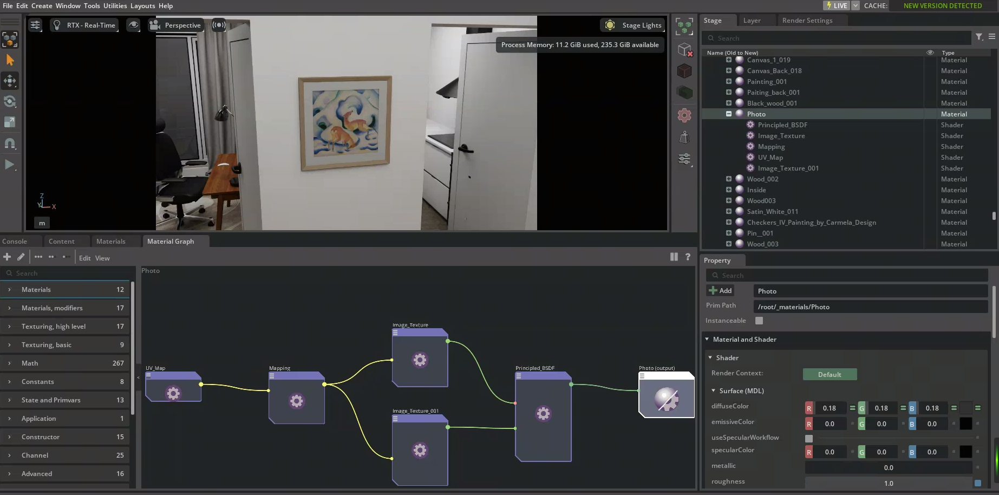

##### PBR材质参数
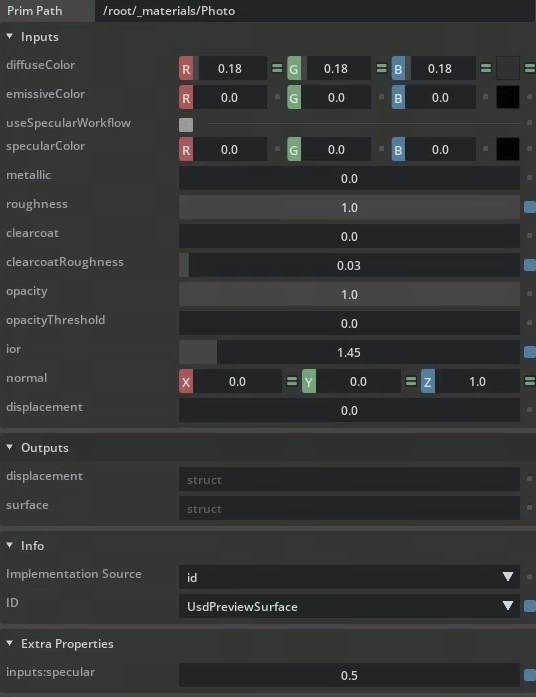
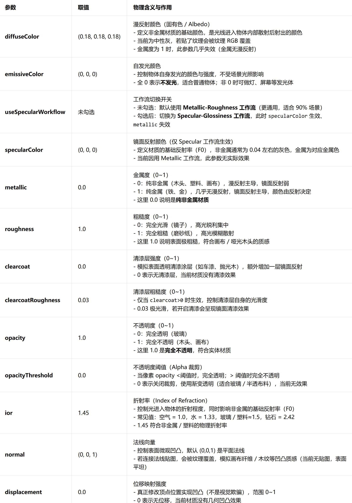
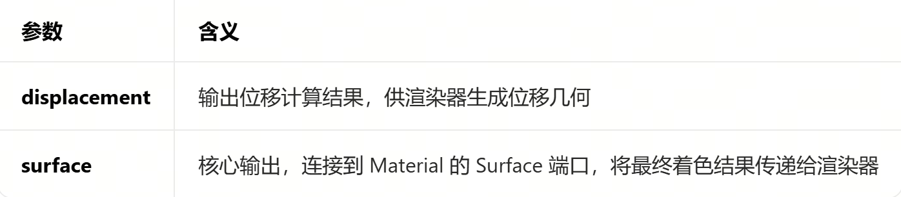
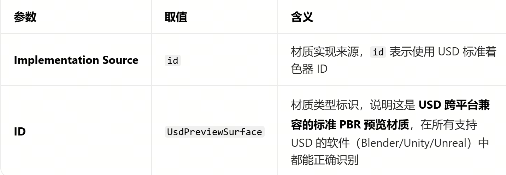
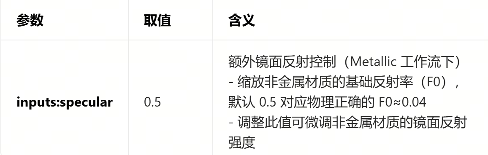


#### 程序修改usd中的pbr
这个在d-isaacsim项目中

#### 超分纹理图
- ComfyUI + SupIR
这部分放弃了，因为4K纹理和blender中直接查看 差别不大

感觉是约束的问题

#### 从约束方面入手解决
改变种子，多看几个场景，然后在debug每一步
```
cd ~/d-infinigen/infinigen


# Generate a blender file
python -m infinigen_examples.generate_indoors \
    --seed 42 \
    --task coarse \
    --output_folder ../outputs/constraint01/coarse \
    -g fast_solve.gin singleroom.gin \
    -p compose_indoors.terrain_enabled=False restrict_solving.restrict_parent_rooms=\[\"DiningRoom\"\]
# 使用blender可视化
python -m infinigen.launch_blender ../outputs/constraint01/coarse/scene.blend
# 导出
python -m infinigen.tools.export \
    --input_folder ../outputs/constraint01/coarse \
    --output_folder ../outputs/constraint01/my_export \
    -f usdc \
    -r 4096 \
    --omniverse


# Generate a blender file
python -m infinigen_examples.generate_indoors \
    --seed 2 \
    --task coarse \
    --output_folder ../outputs/constraint02/coarse \
    -g fast_solve.gin singleroom.gin \
    -p compose_indoors.terrain_enabled=False restrict_solving.restrict_parent_rooms=\[\"DiningRoom\"\]
# 使用blender可视化
python -m infinigen.launch_blender ../outputs/constraint02/coarse/scene.blend
# 导出
python -m infinigen.tools.export \
    --input_folder ../outputs/constraint02/coarse \
    --output_folder ../outputs/constraint02/my_export \
    -f usdc \
    -r 4096 \
    --omniverse


# Generate a blender file
python -m infinigen_examples.generate_indoors \
    --seed 3 \
    --task coarse \
    --output_folder ../outputs/constraint03/coarse \
    -g fast_solve.gin singleroom.gin \
    -p compose_indoors.terrain_enabled=False restrict_solving.restrict_parent_rooms=\[\"DiningRoom\"\]
# 使用blender可视化
python -m infinigen.launch_blender ../outputs/constraint03/coarse/scene.blend
# 导出
python -m infinigen.tools.export \
    --input_folder ../outputs/constraint03/coarse \
    --output_folder ../outputs/constraint03/my_export \
    -f usdc \
    -r 4096 \
    --omniverse
```
